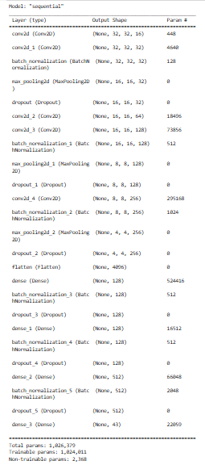
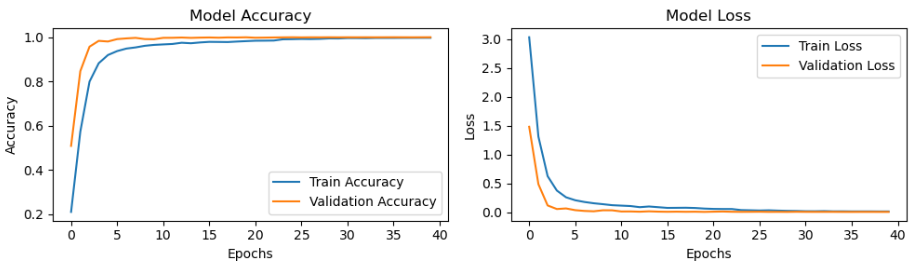
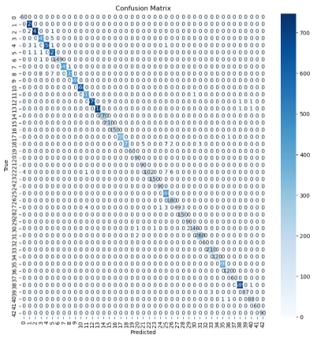
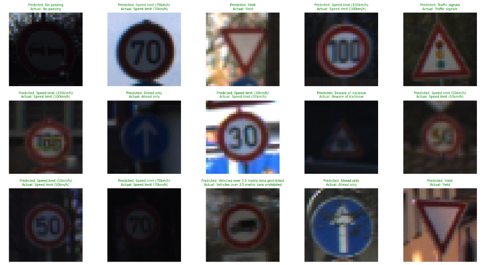
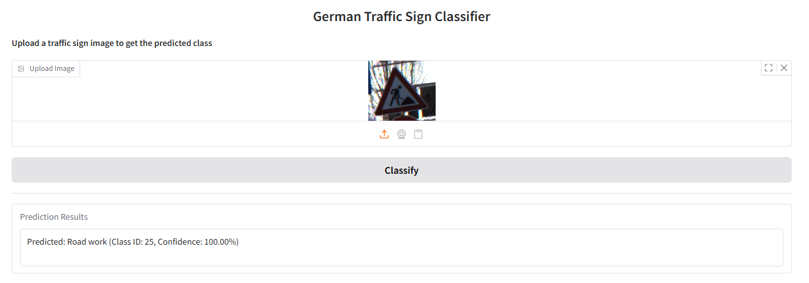

# Traffic Sign Classification
Automatically recognizing traffic signs is a crucial component of autonomous driving systems. This project aims to train deep learning model to accurately classify German traffic signs with high accuracy using CNNs.


## Overview
This project aims to develop a deep learning model that classifies German Traffic Signs into 43 categories using a custom-built Convolutional Neural Network (CNN). The model is trained on the **GTSRB dataset**, which was downloaded from [Kaggle](https://www.kaggle.com/datasets/meowmeowmeowmeowmeow/gtsrb-german-traffic-sign). A user-friendly Gradio interface is created for real-time image classification. This project contributes to the autonomous driving industry by enabling accurate traffic sign recognition - an integral part of driver assistance and self-driving vehicle systems.

---

## Table of Contents

- [Project Structure](#project-structure)
- [Technologies Used](#technologies-used)
- [Installation and Setup](#installation-and-setup)
- [Dataset Overview](#dataset-overview)
- [Data Preprocessing](#data-preprocessing)
- [Model Architecture](#model-architecture)
- [Model Training](#model-training)
- [Model Performance](#model-performance)
- [Gradio Web App](#gradio-web-app)
- [Run Gradio UI Locally](#run-gradio-ui-locally)
- [Conclusion](#conclusion)
- [License](#license)

---

## Project Structure

```
    traffic_sign_classification/
    │
    ├── dataset/
    │   ├── Meta/
    │   ├── Test/
    │   ├── Train/
    │   └── ...
    ├── images/
    │   ├── accuracy_plot.png
    │   ├── confusion_matrix.png
    │   ├── gradio_ui.png
    │   ├── model_architecture.png
    │   └── sample_predictions.png
    ├── app.py
    ├── gtsrb_model.h5
    ├── gtsrb_final_model.h5
    ├── traffic_sign_classification.ipynb
    ├── environment.yml
    ├── requirements.txt
    └── README.md
```

---

## Technologies Used
- Python 3.8+
- Keras/TensorFlow
- OpenCV, NumPy, Pandas
- Matplotlib, Seaborn
- Scikit-learn
- Gradio (for Web App UI)

---

## Installation and Setup

### Prerequisites
Before you begin, make sure you have the following installed:

- Python 3.8+
- Keras
- Tensorflow
- Numpy
- Pandas
- Matplotlib
- Seaborn
- OpenCV
- Scikit-learn
- Gradio

### Installation steps

1. **Clone the Repository**
    ```bash
    git clone https://github.com/Dhanvika27/traffic_sign_classification.git
    cd traffic_sign_classification
    ```

2. **Create & Activate Virtual Environment**
    ```bash
    # Create environment
    python -m venv venv

    # Activate environment (macOS/Linux)
    source venv/bin/activate

    # Activate environment (Windows)
    venv\Scripts\activate
    ```

3. **Install Dependencies**

    - **Using pip:**
       ```bash
       pip install -r requirements.txt
       ```
    
    - **or using conda:**
       ```bash
       conda env create -f environment.yml
       conda activate traffic_sign_classification
       ```
       
> **Note:** Use either `pip` OR `conda` not both to avoid environment conflicts.

---

## Dataset Overview
- **Source:** Kaggle
- **Link:** [GTSRB - German Traffic Sign Recognition Benchmark](https://www.kaggle.com/datasets/meowmeowmeowmeowmeow/gtsrb-german-traffic-sign)
- **Classes:** 43 traffic sign categories
- **Images:** Over 50,000 images for training and testing

> **Note:** You may need to create a Kaggle account and accept terms to download the dataset.

---

### Dataset Folder Structure
After downloading and extracting the dataset from Kaggle, make sure it follows the structure below:
```
    traffic_sign_classification/
        │
        ├── dataset/
        │   ├── Meta/
        │   ├── Train/
        │   ├── Test/
        │   ├── Meta.csv
        │   ├── Train.csv
        │   └── Test.csv
```

- `Train/` : Contains 43 subfolders (0 to 42), one for each class.
- `Test/` : Contains test images (typically flat, with labels in `Test.csv`).
- `*.csv` : Provide structured data mapping images to labels.
- `Meta\` : May include supporting images or info from the dataset provider.

> **Important:** Place the dataset inside the `dataset/` directory at the root level of the project for the code to work correctly.

---

## Data Preprocessing
Before feeding the images into the model, the following preprocessing steps are performed:

- Load images by class folders.
- Resizing each image to 32x32 pixels.
- Normalize pixel values to the range `[0, 1]`.
- One-hot encode the class labels.
- Apply data augmentation using keras `ImageDataGenerator`.
- Split data into training (80%) and validation (20%) sets.

> See details in [`traffic_sign_classification.ipynb`](./traffic_sign_classification.ipynb)

---

## Model Architecture
A Convolutional Neural Network (CNN) model was designed using the Keras Sequential API, specifically for traffic sign classification. The model architecture includes:

- **3 Convolutional Blocks:** With ReLU activation, BatchNormalization, MaxPooling, and Dropout.
- **3 Fully Connected Dense Layers:** With ReLU activation, BatchNormalization, and Dropout.
- **Output Layer:** With softmax activation (43 classes).



---

## Model Training
- **Optimizer:** Adam(LR=0.001)
- **Loss Function:** Categorical Crossentropy
- **Callbacks:** ModelCheckpoint, ReduceLROnPlateau
- **Epochs:** 40
- **Batch Size:** 32

---

## Model Performance
The CNN model trained on GTSRB dataset provides high performance for traffic sign classification tasks. Below are the main evaluation outcomes and visualizations:

- Achieved a **test accuracy of 99.15%** after training for 40 epochs.
- Reached a **low test loss of 0.0348**.

The model generalizes well across all 43 traffic sign classes, as demonstrated by its high accuracy score and low error.

> **Model Files:**
> - `gtsrb_model.h5`: Intermediate model checkpoint saved during training.
> - `gtsrb_final_model.h5`: Final trained model used in the Gradio app.

### Accuracy and Loss Curves
Training and validation metrics show steady learning progression with no signs of overfitting:



### Confusion Matrix
The confusion matrix below demonstrates the model's precise classification across all 43 classes:



### Sample Predictions
Below are sample test images with both predictions and ground truth labels. Green titles indicate correct predictions while red ones indicate errors:



---

## Gradio Web App
A **Gradio-based web application** allows users to upload traffic sign image and receive real-time predictions with confidence scores.



### How to Use the App
1. Upload a traffic sign image using the Gradio interface.
2. Click **"Classify"**.
3. View the predicted Class label, ID, and Confidence level.

> **Note:** The Gradio interface depends on the `gradio` Python package. Make sure it's installed in your environment (`pip install gradio` or ensure it's included in `requirements.txt` or `environment.yml`).

### Run Gradio UI Locally
1. Ensure you've completed [Installation and Setup](#installation-and-setup).
2. Run the app locally:

   ```bash
   python app.py
   ```
A browser window will open with Gradio interface at `http://localhost:7860`.

---

## Conclusion
This project demonstrates the effective use of Convolutional Neural Network (CNN) to classify traffic signs with high accuracy. By applying thorough preprocessing, a well structured model, and a responsive GUI, it simulates a real-world application in autonomous vehicle systems.

---

## License
This project is released under the [MIT License](LICENSE). You are free to use, modify, and distribute it with proper attribution.